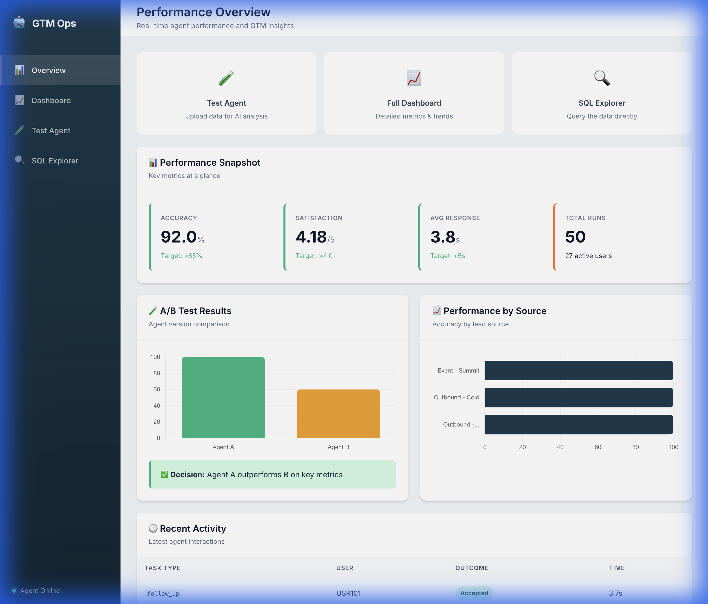
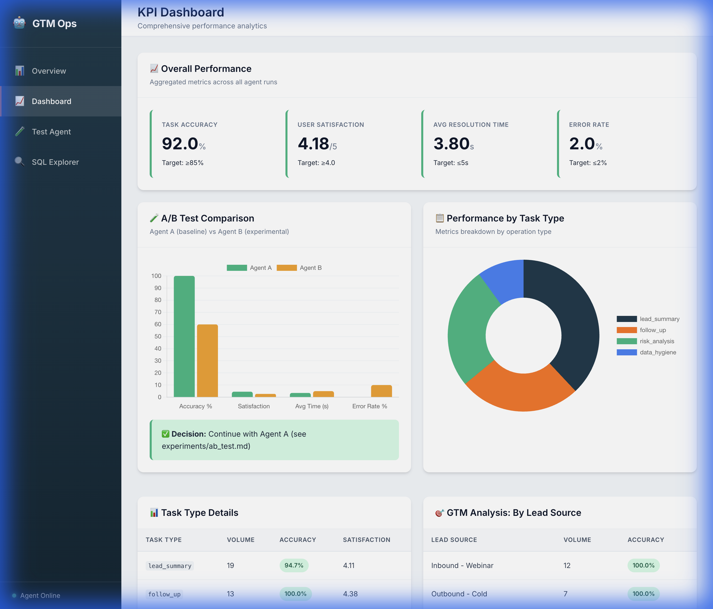
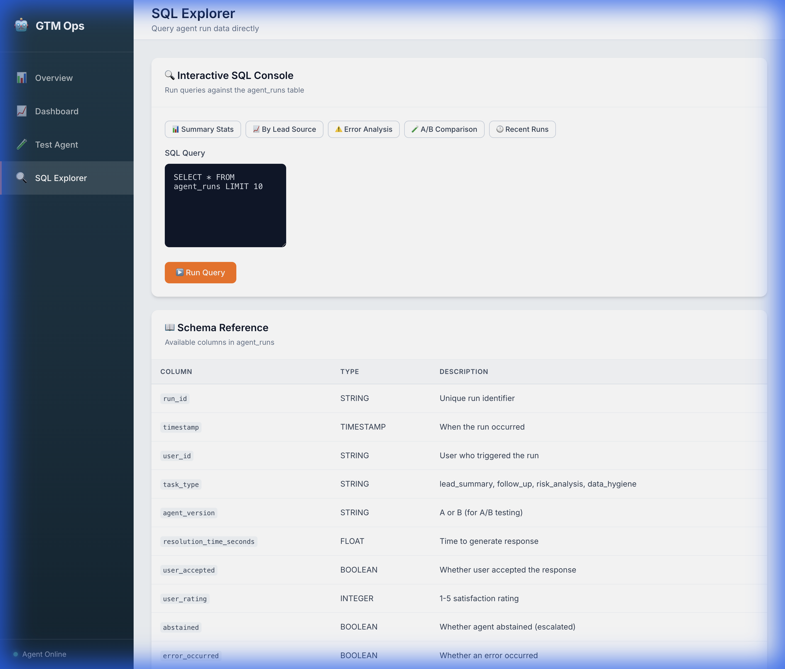
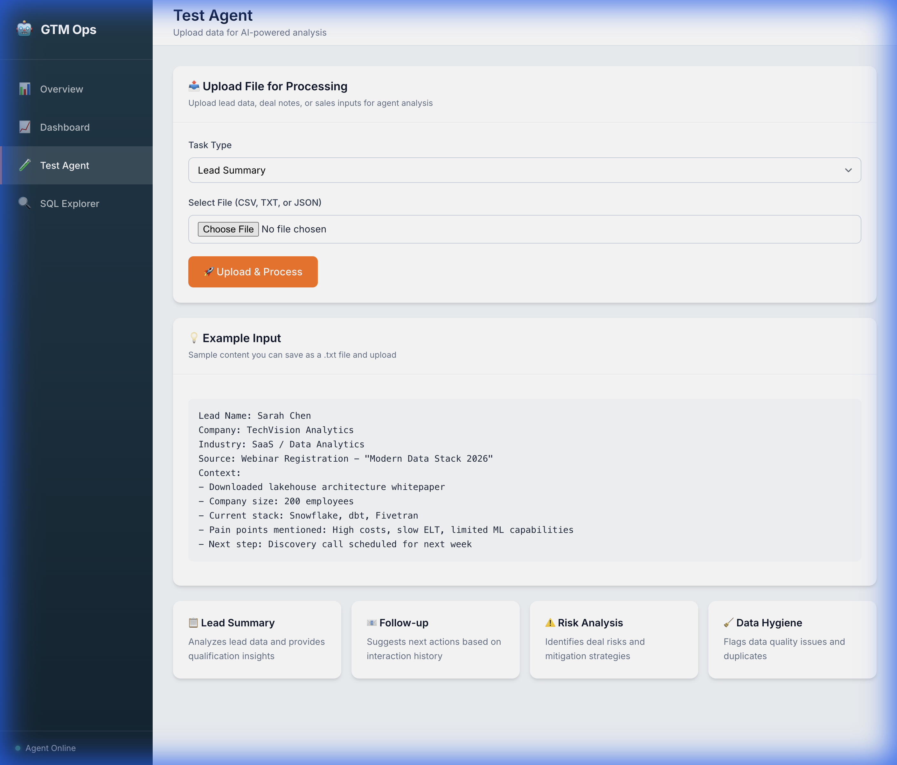

# Databricks AI Agent Operations & GTM Ops Simulator

A production-style **AI Agent Operations & GTM Ops Simulator** demonstrating how AI agents are defined, governed, QA'd, monitored, and rolled out inside a sales-facing environment.

This project showcases **AI Operations, QA, governance, KPIs, dashboards, A/B testing, enablement, and GTM readiness** for a modern data and AI company.

## ✨ What's New (January 2026)

### Premium UI Overhaul
- **Databricks-Inspired Design** - Professional sidebar navigation with deep blue/orange color palette
- **Interactive Chart.js Visualizations** - Bar charts, doughnut charts, and trend lines with real-time data
- **SQL Explorer** - Query agent run data directly with preset templates and schema reference
- **Live Feedback Loop** - Every agent test logs to the database, updating dashboards in real-time

### Key Features Added
| Feature | Description |
|---------|-------------|
| 🎨 Sidebar Navigation | Persistent nav with Overview, Dashboard, Test Agent, SQL Explorer |
| 📊 Interactive Charts | A/B Test Comparison, Performance by Task Type, Daily Trends |
| 🔍 SQL Explorer | Run SQL queries against `agent_runs` with preset query templates |
| ⚡ Live Data Loop | Agent tests automatically append to CSV and reflect in metrics |
| 🧪 A/B Test Results | Visual comparison of Agent A vs Agent B with decision recommendation |

## 🎯 Project Overview

This simulator demonstrates:

- **Business Intent & Governance** - How AI agent behavior is defined and constrained
- **AI Agent Operations** - Agent implementation using Hugging Face LLMs
- **QA & Validation** - Pre-deployment testing and validation workflows
- **KPIs & Analytics** - SQL-based metrics tracking and analysis
- **Dashboards** - Operational health monitoring with interactive visualizations
- **A/B Testing** - Data-driven rollout decisions with statistical analysis
- **Enablement** - User guidance and business reviews

## 🏗️ Project Structure

```
Databricks-AI-Agent-Operations-&-GTM-Ops-Simulator/
├── README.md                          # This file
├── requirements.txt                   # Python dependencies
├── .gitignore                         # Git exclusions
│
├── docs/                              # Business documentation
│   ├── business_intent.md            # Agent definition & governance
│   ├── kpis.md                       # KPI definitions
│   ├── rollout_plan.md               # Deployment strategy
│   └── enablement.md                 # User guidance
│
├── agent/                             # AI Agent implementation
│   ├── agent.py                      # Core agent logic
│   └── prompts.py                    # Prompt templates
│
├── qa/                                # Quality assurance
│   ├── test_cases.json               # Structured test cases
│   └── run_qa.py                     # QA test runner
│
├── data/                              # Data storage
│   ├── sample_agent_runs.csv         # Sample agent interaction data
│   └── uploaded_inputs/              # User-uploaded files
│
├── analytics/                         # Data analytics
│   ├── load_data.py                  # Data ingestion (DuckDB)
│   └── queries.sql                   # SQL queries for KPIs
│
├── dashboards/                        # Visualization
│   └── kpi_dashboard.ipynb           # Jupyter dashboard
│
├── experiments/                       # A/B testing
│   └── ab_test.md                    # Experiment documentation
│
├── reviews/                           # Business reviews
│   └── weekly_business_review.md     # Review template
│
└── webapp/                            # Web application
    ├── app.py                        # FastAPI application
    ├── templates/                    # Jinja2 templates
    │   ├── layout.html              # Shared layout with sidebar
    │   ├── index.html               # Overview page
    │   ├── dashboard.html           # KPI dashboard
    │   ├── upload.html              # Test agent page
    │   └── explorer.html            # SQL Explorer
    └── static/
        └── styles.css               # Premium CSS design system
```

## 🚀 Quick Start

### 1. Clone & Setup

```bash
# Clone the repository
git clone https://github.com/yourusername/Databricks-AI-Agent-Operations-GTM-Ops-Simulator.git
cd Databricks-AI-Agent-Operations-GTM-Ops-Simulator

# Create virtual environment
python3 -m venv venv
source venv/bin/activate  # macOS/Linux
# venv\Scripts\activate   # Windows

# Install dependencies
pip install -r requirements.txt
```

### 2. Configure Hugging Face Token (Optional)

```bash
export HF_TOKEN="your_huggingface_token_here"
```

Get a free token from [Hugging Face](https://huggingface.co/settings/tokens). The agent works without a token using mock responses.

### 3. Run the Web Application

```bash
cd webapp
HF_TOKEN=your_token uvicorn app:app --host 0.0.0.0 --port 8000
```

Open your browser to: **http://localhost:8000**

## 📸 Screenshots

### Performance Overview (Home Page)
The landing page shows real-time KPIs, A/B test comparisons, lead source performance, and recent activity—all with interactive Chart.js visualizations.



### KPI Dashboard
Comprehensive metrics including Task Accuracy (92%), User Satisfaction (4.18/5), Resolution Time, and Error Rate. Interactive bar charts compare Agent A vs Agent B performance.



### SQL Explorer
Query the `agent_runs` data directly using SQL. Includes preset query buttons for common analyses and a full schema reference.



### Test Agent
Upload lead data, deal notes, or sales inputs to test the AI agent. Select a task type and receive real LLM-powered analysis with feedback buttons.



### AI Agent Response
Real AI-generated analysis from the Llama-3.2 model. Includes Company Overview, Industry & Use Case Fit, Suggested Questions, and Recommended Next Steps.


## 🎯 Role Alignment: AI Operations Program Manager

This project demonstrates core competencies for **AI Operations** roles:

| Competency | Demonstration |
|------------|---------------|
| **Lifecycle Management** | From Business Intent to Field Enablement |
| **Analytical Monitoring** | SQL-driven dashboards for KPI optimization |
| **Governance & Accountability** | QA tests, human-in-the-loop escalation, UAT |
| **A/B Testing** | Data-driven decisions with Agent A vs B comparison |
| **Continuous Improvement** | Prompt iteration logs based on field feedback |
| **Stakeholder Leadership** | Weekly Business Review templates |

## 🚀 Key Features

### 🤖 AI Agent
- Accepts GTM tasks: lead summaries, follow-up suggestions, deal risk signals
- Uses Hugging Face LLMs (Llama-3.2-3B-Instruct)
- Implements governance rules and escalation logic
- Falls back to mock responses without token

### 📊 Interactive Dashboards
- **Overview**: Quick KPI snapshot, A/B comparison charts, recent activity
- **Dashboard**: Detailed metrics, trends, task type breakdown
- **SQL Explorer**: Direct data querying with preset templates
- **Live Updates**: Every test agent run updates the dashboards

### 🔍 SQL Explorer
Run queries directly against the agent data:
```sql
SELECT lead_source, COUNT(*) as volume, 
       ROUND(AVG(CASE WHEN user_accepted THEN 1.0 ELSE 0.0 END) * 100, 1) as accuracy
FROM agent_runs 
GROUP BY lead_source
ORDER BY accuracy DESC
```

### 🧪 A/B Testing
- Real-time comparison of Agent A (control) vs Agent B (experimental)
- Visual charts showing accuracy, satisfaction, and error rates
- Decision recommendations based on success criteria
- Detailed analysis in `experiments/ab_test.md`

### ✅ QA & Validation
- Structured test cases in JSON
- Automated test runner
- Accuracy, hallucination, and rule violation tracking
- Results feed into analytics pipeline

## 🛠️ Tech Stack

| Component | Technology |
|-----------|------------|
| Backend | FastAPI + Python |
| Frontend | Jinja2 + Chart.js |
| Database | DuckDB (in-memory SQL) |
| LLM | Hugging Face Inference API |
| Styling | Custom CSS (Databricks-inspired) |
| Data Format | CSV with live appends |

## 🔒 Security & Best Practices

- ✅ Secrets via environment variables (no credentials in code)
- ✅ Input validation and SQL injection prevention
- ✅ Virtual environment isolation
- ✅ Rate limiting and security headers
- ✅ Professional error handling

## 🧪 Running QA Tests

```bash
python qa/run_qa.py
```

## 📈 Viewing Analytics (CLI)

```bash
python analytics/load_data.py
```

This loads data into DuckDB and executes queries from `analytics/queries.sql`.

## 📝 Documentation

See the `docs/` directory for detailed documentation:

- **business_intent.md** - Agent definition, rules, and success criteria
- **kpis.md** - Metric definitions and tracking methodology
- **rollout_plan.md** - Phased deployment strategy
- **enablement.md** - User training and guidance
- **experiments/ab_test.md** - A/B test methodology and results

## 🤝 Contributing

This is a demonstration project. Feel free to fork and adapt for your own use cases.

## 📄 License

MIT License - See LICENSE file for details

---

**Built to demonstrate AI Operations excellence in GTM environments**

*Last Updated: January 2026*
