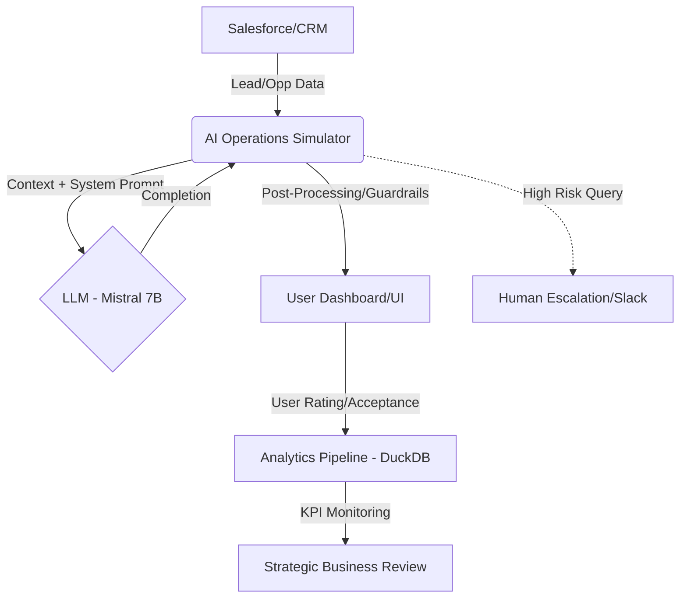

# Business Intent & Governance

## Document Purpose

This document defines the **business intent** for AI agents supporting Databricks GTM Operations. It establishes what agents should do, what they must not do, and how they align with sales organization goals.

---

## Target Users

### Primary Users
- **Sales Development Representatives (SDRs)** - Qualifying inbound leads, outbound prospecting
- **Account Executives (AEs)** - Managing opportunities, deal progression, customer engagement
- **Sales Operations** - Data hygiene, reporting, pipeline analysis, forecasting support

### Secondary Users
- **Sales Managers** - Team performance monitoring, coaching insights
- **Revenue Operations** - Cross-functional GTM analytics and optimization

---

## Agent Purpose & Capabilities

### What the Agent SHOULD Do

#### 1. Lead Intelligence & Qualification
- Summarize lead information from multiple sources (CRM, web activity, intent signals)
- Suggest qualification questions based on lead profile
- Flag high-intent signals (demo requests, pricing page visits, competitor searches)
- Recommend next best actions for SDRs

#### 2. Opportunity Support
- Analyze deal health based on activity patterns, engagement, and timeline
- Identify risk signals (stalled deals, missing stakeholders, pricing concerns)
- Suggest value propositions aligned with industry and use case
- Generate follow-up recommendations based on last interaction

#### 3. Customer Intelligence
- Synthesize account history and past interactions
- Highlight renewal risks or expansion opportunities
- Surface relevant case studies and proof points
- Identify cross-sell/upsell potential

#### 4. Data Hygiene & Enrichment
- Flag incomplete or outdated CRM records
- Suggest data enrichment sources
- Identify duplicate records
- Validate contact information completeness

---

## Agent Constraints & Guardrails

### What the Agent MUST NOT Do

#### 1. No Autonomous External Communication
- **Never** send emails, Slack messages, or any communication to customers/prospects without human approval
- **Never** update CRM fields that impact financial reporting (ARR, stage progression, close dates)
- **Never** create or delete CRM records autonomously

#### 2. No Unauthorized Data Access
- **Never** access data outside the user's assigned territory or accounts
- **Never** share information across different security boundaries
- **Never** expose PII or sensitive customer data in logs

#### 3. No Strategic Decisions
- **Never** recommend pricing or discounting without explicit human review
- **Never** make commitments on product roadmap, features, or timelines
- **Never** assess legal or compliance topics (BAAs, DPAs, security questionnaires)

#### 4. No Hallucination or Speculation
- **Never** fabricate customer quotes, data points, or case study results
- **Never** make claims about product capabilities not documented in official sources
- **Never** provide technical answers outside of approved positioning

---

## Escalation & Abstention Rules

### When to Escalate to Human

The agent **must abstain and escalate** when:

1. **High-Risk Scenarios**
   - Customer expresses dissatisfaction or churn intent
   - Legal, security, or compliance questions arise
   - Pricing negotiations or discount requests
   - Competitive displacement situations

2. **Ambiguous Situations**
   - Insufficient data to make a confident recommendation
   - Request involves technical product details not in knowledge base
   - User intent is unclear or contradictory

3. **Sensitive Topics**
   - Executive-level communications
   - Partner or channel conflict scenarios
   - Data privacy or security incidents

### Escalation Protocol

```
IF risk_level == HIGH OR confidence < 70%:
    RETURN escalation_message + reasoning + suggested_human_owner
ELSE:
    RETURN agent_response + confidence_score
```

---

## 🔄 Systems Integration & Data Flow
The agent acts as an Orchestration Layer between CRM and LLM.



## Success Criteria

### Business Outcomes

The agent is successful when it drives:

1. **Efficiency Gains**
   - 30%+ reduction in time spent on routine lead research
   - 20%+ faster response time to inbound leads
   - 15%+ improvement in data hygiene scores

2. **Quality Improvements**
   - Higher lead qualification accuracy
   - More personalized outreach messaging
   - Better deal risk identification

3. **User Adoption**
   - 70%+ weekly active usage among target users
   - 4.0+ satisfaction score (1-5 scale)
   - <10% escalation rate for abstention decisions

### Operational Metrics

Track these KPIs (see `kpis.md` for details):

- **Task Accuracy** - % of agent outputs accepted by users without modification
- **Resolution Speed** - Median time from query to useful output
- **Abstention Rate** - % of queries where agent correctly defers to human
- **User Satisfaction** - Direct feedback and implicit acceptance rates
- **Error Rate** - Hallucinations, rule violations, or incorrect outputs

---

## Governance & Review Cadence

### Pre-Deployment
- QA test suite must achieve 95%+ pass rate
- Manual review of 50 representative test cases
- Security and compliance sign-off

### Post-Deployment
- **Daily**: Monitor error rates and escalation patterns
- **Weekly**: Review user feedback and satisfaction scores
- **Monthly**: Business review with stakeholders (see `reviews/weekly_business_review.md`)
- **Quarterly**: Agent performance audit and retraining assessment

---

## Alignment with GTM Strategy

This agent supports Databricks GTM priorities:

- **Velocity** - Accelerate sales cycles through faster, better intelligence
- **Scale** - Enable reps to handle more opportunities with quality
- **Customer Focus** - Personalize engagement based on data-driven insights
- **Operational Excellence** - Maintain data hygiene and process compliance

By adhering to this business intent, the AI agent serves as a **force multiplier** for GTM teams while maintaining appropriate human oversight and governance.

---

**Document Owner**: Sales Operations & AI Ops  
**Last Updated**: 2026-01-11  
**Review Frequency**: Quarterly or upon major agent version changes
